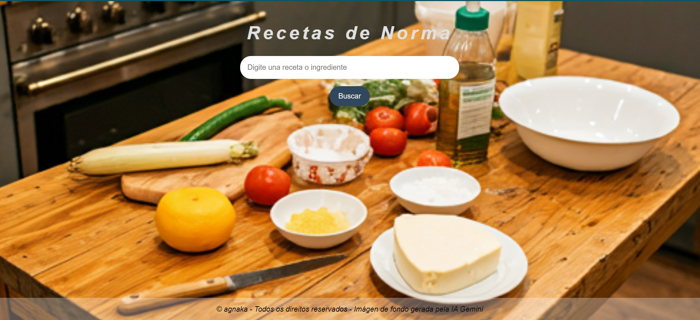

### <h2>Recetas de Norma</h2> 
**Site em desenvolvimento**

**Considerações inicias**

Comecei desenvolver este sitio depois de finalizar a Imersão Dev com Google Gemini, ministrada pela Alura junto com a Google, para poder treinar e achei bem legal ter tudo documentado e de fácil acesso para  aminmha família.
Sou argetnino e me mudei há muitos anos para São Pauço e tive que aprender a cozinhar os pratos que minha mãe, "Norma" fazia.
Comecei com os que geralmente faço, que são Guiso Picante e Arroz con Pollo.

**_Imagem do Site_**
A imagem do background foi solicitada ao Gemini especificando o mais possível no prompt o que estava querendo.

  <figure>
    
    Tela computador
  </figure>
  <!-- <figure>
    
    Tela celular
  </figure> -->

 

**O que faz essa aplicação?**

Essa aplicação simples, onde cadastrei as receitas que tenho num caderno e poder buscar com o nome da receita ou de ingredientes

**Como funciona?**

1. **Digite e pesquise:** Na barra de pesquisa, digite o nome do da receita (parte dela) o ingrediente.
2. **Veja os resultados:** A aplicação irá procurar por todos as receitas que correspondem à sua pesquisa e exibir os resultados de forma clara e organizada.

**Tecnologias utilizadas:**

*  
* 
* 

**Responsividade:**

Ainda não desenvolvida

**Como usar este projeto:**

**Observações:**

* **Goolge Gemini:** Todo o projeto foi assistido pelo Google Gemini, como este README que foi feito com ajuda dele.

<h2>Autor</h2> 

 Andrés Nakagawa

**#recetas #programação #javascript #html #css**

